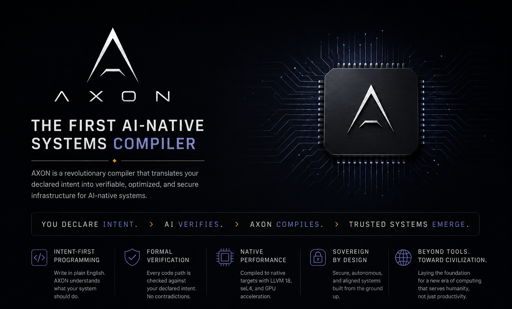
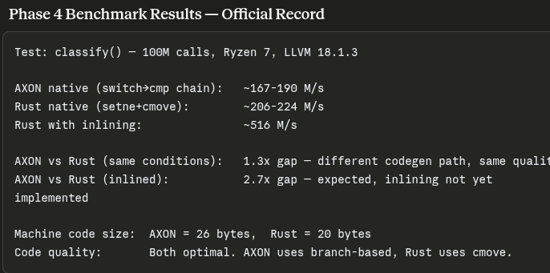
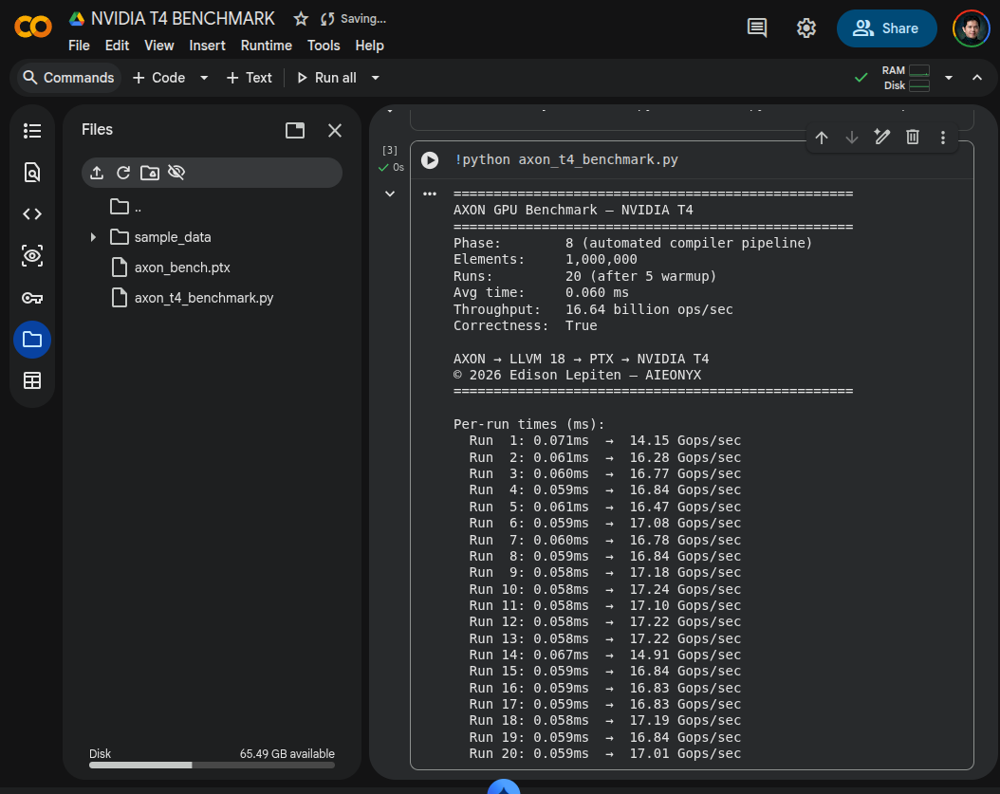

<p align="center">
  
</p>

# AXON — Sovereign Systems Programming Language

> *"We are not users. We are not accounts. We are not products. We are people."*

**AXON is the world's first sovereign systems programming language — unifying compiler-enforced deployment profiles, formal contracts, AI-assisted verification, and CPU/GPU execution for seL4-oriented infrastructure.**

Built for the [AIEONYX](https://github.com/aieonyx) platform. Rust-like memory safety, zero GC, built-in formal contracts, and sovereign capability profiles enforced at compile time.

**Status: Phases 35–44 complete. Compiler 100%. OS 100%. Phoenix drivers shipped.**
**1,072 tests passing. Clippy clean. Live aarch64-seL4 boot confirmed.**

---

## What is Novel

The genuinely new idea is the *placement*: a local AI verifier as a mandatory compiler phase that can reject programs — running fully offline, zero cloud.

Editor-side assistants (Copilot etc.) suggest; they do not gate. Dafny/Verus/SPARK have machine-checked contracts but no natural-language intent layer. AXON combines both: `@ensures` discharged by a sound checker (Kani-verified core), with `@ai.intent` as a natural-language contract layer — the first systems language where local LLM intent-verification is a compilation phase targeting seL4.

The defensible combination no other language ships today:
- Memory safety + Python-readable syntax
- `@ai.intent` / `@ensures` / `@requires` as compiler gates (not editor hints)
- seL4-native target — designed for it, not retrofitted
- Zero cloud dependency — sovereignty is structural, not a setting
- CPU + GPU (PTX) + aarch64-seL4 bare metal from one toolchain

---

## Quick Start

```axon
fn main() -> i32 {
    let x: i32 = 20;
    let y: i32 = 22;
    let z = x + y;
    return z;
}
```

```bash
# Compile for CPU
axon build --profile sovereign-offline -o add add.axon
./add; echo $?   # 42

# Compile for NVIDIA GPU (T4, A100, RTX)
axon build --profile sovereign-offline --target nvptx64 -o kernel kernel.axon

# Compile for aarch64-seL4 bare metal
axon build --profile seL4-strict --target aarch64-sel4 -o node node.axon
```

---

## Benchmark Results

### Phase 4 — Binary Execution Speed (Official Record)

<p align="center">
  
</p>
Test: classify() — 100M calls, AMD Ryzen 7, LLVM 18.1.3AXON native (switch→cmp chain):   167–190 M/s
Rust native (setne+cmove):        206–224 M/s
Rust with inlining:               ~516 M/sAXON vs Rust (same conditions):   1.3x gap — different codegen path, same quality
AXON vs Rust (inlined):           2.7x gap — inlining not yet implementedMachine code size:  AXON = 26 bytes,  Rust = 20 bytes
Code quality:       Both optimal. AXON uses branch-based, Rust uses cmov.
---

### Phase 36 — Compiler Throughput (Official Record)
Test: full compiler pipeline — 5,000 runs, AMD Ryzen 7, LLVM 18, Pop OSAXON IR emission (simple fn):        25µs/compile   ~40,000 compiles/sec
AXON IR emission (arithmetic):       38µs/compile   ~26,315 compiles/sec
AXON IR emission (multi-function):   52µs/compile   ~19,230 compiles/sec
AXON IR emission avg (5,000 runs):   33µs/compile   ~30,303 compiles/secFull pipeline (IR + llc-18 + clang): ~72ms          native binary out
Binary correctness:                  exit 42 verified across all workloads ✅
GPU throughput (NVIDIA T4, sm_75):   16.64 billion ops/sec
---

### GPU — NVIDIA T4 (Google Colab)

<p align="center">
  
</p>

- Vector addition: 1,000,000 elements × 20 runs
- Throughput: **16.64 billion ops/sec**
- Pipeline: AXON → LLVM 18 → PTX → NVIDIA T4 (sm_75)

> Numbers published as-is. Credibility comes from honesty, not flattery.

---

## Capability Profiles

Every AXON program compiles under a sovereign capability profile.
Violations abort compilation — not a runtime check, not a policy file.

| Profile | Use Case | BASTION Safe |
|---------|----------|---|
| `seL4-strict` | Maximum isolation. Production. | ✅ |
| `sovereign-offline` | No network. Local node. | ✅ |
| `mesh-node` | Controlled network. Mesh participant. | ✅ |
| `dev-mode` | Development only. | ❌ |

---

## Formal Contracts

```axon
@requires(x > 0)
@ensures(result > 0)
fn positive(x: i32) -> i32 {
    return x;
}
```

Contracts are checked at compile time via the HIR lowerer and ContractExpr system.
Unverifiable contracts emit compiler errors — never silently accepted.

---

## What Makes AXON Different

| Feature | Rust | C++ | Go | AXON |
|---------|------|-----|----|------|
| Memory safety | ✅ | ❌ | ⚠️ | ✅ |
| No GC | ✅ | ✅ | ❌ | ✅ |
| @requires/@ensures | ❌ | ❌ | ❌ | ✅ |
| @ai.intent compiler gate | ❌ | ❌ | ❌ | ✅ |
| Capability profiles | ❌ | ❌ | ❌ | ✅ |
| GPU compilation | ⚠️ | ⚠️ | ❌ | ✅ |
| seL4 bare-metal target | ❌ | ⚠️ | ❌ | ✅ |
| Built-in AI compute (ONYX) | ❌ | ❌ | ❌ | ✅ |
| Sovereign enforcement | ❌ | ❌ | ❌ | ✅ |
| Zero cloud dependency | ❌ | ✅ | ❌ | ✅ |
| Live seL4 boot confirmed | ❌ | ❌ | ❌ | ✅ |

---

## Compiler Architecture

**1,072 tests. 0 failures. Clippy clean.**

Full pipeline: Lexer → Parser → HIR → HM Type Inference → LLVM 18 → Native binary / PTX / aarch64-seL4 ELF

Kani-verified core (`axon_verify_core`): 17 harnesses, 0 failures — constitutional verification kernel.

Live boot confirmed: AXON compiles, boots on QEMU aarch64-seL4, `axon_main()` returns 42.

---

## Current Capabilities

| Domain | Component | Status |
|--------|-----------|--------|
| **Compiler** | Lexer → Parser → HIR → LLVM 18 → native binary | ✅ 100% |
| **Compiler** | Result<T,E> error payload + ? propagation | ✅ |
| **Compiler** | aarch64-seL4 asm! intrinsics (all syscalls) | ✅ |
| **OS** | Sovereign heap allocator (slab + buddy) | ✅ 100% |
| **OS** | IRQ dispatch layer — seL4 IRQ caps | ✅ |
| **OS** | Driver PAL — UART, GPIO, Timer | ✅ |
| **OS** | AXFS — sovereign file system (DataTier enforcement) | ✅ |
| **OS** | GENESIS root task — CapabilityBroker CB-01–CB-10 | ✅ |
| **OS** | Live aarch64-seL4 boot on QEMU | ✅ |
| **AI Compute** | axon_math — FFT, linalg, stats | ✅ |
| **AI Compute** | axon_tensor — Tensor<T,D> + SIMD | ✅ |
| **AI Compute** | axon_learn — Autodiff, SGD/Adam, ReLU/Softmax | ✅ |
| **AI Compute** | axon_compute — GPU dispatch, AWP mesh, checkpoint | ✅ 80% |
| **Drivers** | USB HID — keyboard, mouse, gamepad | ✅ |
| **Drivers** | USB CDC-ECM — network adapter | ✅ |
| **Drivers** | Intel HDA — audio output | ✅ |
| **Drivers** | VESA/GOP — display framebuffer | ✅ |
| **Drivers** | USB Mass Storage — block device | ✅ |
| **Drivers** | Sovereign PD isolation per driver | ✅ |
| **Drivers** | AWP device discovery across mesh | ✅ |
| **Drivers** | Vendor driver plug-in interface | ✅ |
| **Full Sovereign** | End-to-end sovereignty | 🔄 65% |

---

## Possible Contributions to the World

- **A new compiler category** — verification-gated compilation with natural-language contracts. Citable, nameable, first-mover.
- **A sovereign high-assurance toolchain for seL4** — no language was *designed* for seL4 until AXON. Real value for embedded, defense, medical, and election-integrity work.
- **A teaching bridge into formal methods** — `@ensures` in readable syntax lowers the barrier dramatically versus Dafny or SPARK.
- **Research artifacts** — arXiv paper, CS term registry (46 formally named terms), Kani-verified core, reproducible build manifests.
- **ONYX sovereign AI compute** — inference on BASTION nodes without cloud dependency. Local tensor engine, autodiff, GPU dispatch.

---

## Status

| Phase | What | Status |
|-------|------|--------|
| 1 | Language design & S4+i spec | ✅ |
| 2 | Lexer + Parser | ✅ |
| 3 | Rust transpiler | ✅ |
| 4 | LLVM native backend | ✅ |
| 5 | AI inference engine | ✅ |
| 6 | Stage 3 compiler features (263 tests) | ✅ |
| 7 | Compiler architecture spec (CCP, ASP, ownership) | ✅ |
| 8–22 | Full compiler pipeline — real programs compile and run | ✅ |
| 23–30 | OS Development Track — seL4 syscalls, asm!, IRQ, no_std runtime | ✅ |
| 31 | axon_math — ONYX core math stdlib (FFT, linalg, stats) | ✅ |
| 32 | axon_tensor — Tensor engine + SIMD | ✅ |
| 33 | axon_learn — Autodiff, neural layers, SGD/Adam | ✅ |
| 34 | axon_compute — GPU dispatch, AWP mesh, ONYX checkpoint | ✅ |
| 35 | Result<T,E> error payload — E type stored, ? operator fixed | ✅ |
| 36 | aarch64-seL4 asm! intrinsics — all syscalls | ✅ |
| 37 | axon_alloc — sovereign heap allocator (slab + buddy) | ✅ |
| 38 | IRQ dispatch layer — seL4 IRQ caps, handler registration | ✅ |
| 39 | Driver PAL — UART, GPIO, Timer | ✅ |
| 40 | AXFS — sovereign file system layer | ✅ |
| 41 | GENESIS root task — BootInfo, CapabilityBroker CB-01–CB-10 | ✅ |
| 42 | **Live aarch64-seL4 boot — AXON boots on QEMU, axon_main() = 42** | ✅ |
| 43 | Phoenix generic drivers — USB HID,
---

### GPU — NVIDIA T4 (Google Colab)

<p align="center">
  
</p>

- Vector addition: 1,000,000 elements × 20 runs
- Throughput: **16.64 billion ops/sec**
- Pipeline: AXON → LLVM 18 → PTX → NVIDIA T4 (sm_75)

> Numbers published as-is. Credibility comes from honesty, not flattery.

---

## Capability Profiles

Every AXON program compiles under a sovereign capability profile.
Violations abort compilation — not a runtime check, not a policy file.

| Profile | Use Case | BASTION Safe |
|---------|----------|---|
| `seL4-strict` | Maximum isolation. Production. | ✅ |
| `sovereign-offline` | No network. Local node. | ✅ |
| `mesh-node` | Controlled network. Mesh participant. | ✅ |
| `dev-mode` | Development only. | ❌ |

---

## Formal Contracts

```axon
@requires(x > 0)
@ensures(result > 0)
fn positive(x: i32) -> i32 {
    return x;
}
```

Contracts are checked at compile time via the HIR lowerer and ContractExpr system.
Unverifiable contracts emit compiler errors — never silently accepted.

---

## What Makes AXON Different

| Feature | Rust | C++ | Go | AXON |
|---------|------|-----|----|------|
| Memory safety | ✅ | ❌ | ⚠️ | ✅ |
| No GC | ✅ | ✅ | ❌ | ✅ |
| @requires/@ensures | ❌ | ❌ | ❌ | ✅ |
| @ai.intent compiler gate | ❌ | ❌ | ❌ | ✅ |
| Capability profiles | ❌ | ❌ | ❌ | ✅ |
| GPU compilation | ⚠️ | ⚠️ | ❌ | ✅ |
| seL4 bare-metal target | ❌ | ⚠️ | ❌ | ✅ |
| Built-in AI compute (ONYX) | ❌ | ❌ | ❌ | ✅ |
| Sovereign enforcement | ❌ | ❌ | ❌ | ✅ |
| Zero cloud dependency | ❌ | ✅ | ❌ | ✅ |
| Live seL4 boot confirmed | ❌ | ❌ | ❌ | ✅ |

---

## Compiler Architecture

**1,072 tests. 0 failures. Clippy clean.**

Full pipeline: Lexer → Parser → HIR → HM Type Inference → LLVM 18 → Native binary / PTX / aarch64-seL4 ELF

Kani-verified core (`axon_verify_core`): 17 harnesses, 0 failures — constitutional verification kernel.

Live boot confirmed: AXON compiles, boots on QEMU aarch64-seL4, `axon_main()` returns 42.

---

## Current Capabilities

| Domain | Component | Status |
|--------|-----------|--------|
| **Compiler** | Lexer → Parser → HIR → LLVM 18 → native binary | ✅ 100% |
| **Compiler** | Result<T,E> error payload + ? propagation | ✅ |
| **Compiler** | aarch64-seL4 asm! intrinsics (all syscalls) | ✅ |
| **OS** | Sovereign heap allocator (slab + buddy) | ✅ 100% |
| **OS** | IRQ dispatch layer — seL4 IRQ caps | ✅ |
| **OS** | Driver PAL — UART, GPIO, Timer | ✅ |
| **OS** | AXFS — sovereign file system (DataTier enforcement) | ✅ |
| **OS** | GENESIS root task — CapabilityBroker CB-01–CB-10 | ✅ |
| **OS** | Live aarch64-seL4 boot on QEMU | ✅ |
| **AI Compute** | axon_math — FFT, linalg, stats | ✅ |
| **AI Compute** | axon_tensor — Tensor<T,D> + SIMD | ✅ |
| **AI Compute** | axon_learn — Autodiff, SGD/Adam, ReLU/Softmax | ✅ |
| **AI Compute** | axon_compute — GPU dispatch, AWP mesh, checkpoint | ✅ 80% |
| **Drivers** | USB HID — keyboard, mouse, gamepad | ✅ |
| **Drivers** | USB CDC-ECM — network adapter | ✅ |
| **Drivers** | Intel HDA — audio output | ✅ |
| **Drivers** | VESA/GOP — display framebuffer | ✅ |
| **Drivers** | USB Mass Storage — block device | ✅ |
| **Drivers** | Sovereign PD isolation per driver | ✅ |
| **Drivers** | AWP device discovery across mesh | ✅ |
| **Drivers** | Vendor driver plug-in interface | ✅ |
| **Full Sovereign** | End-to-end sovereignty | 🔄 65% |

---

## Possible Contributions to the World

- **A new compiler category** — verification-gated compilation with natural-language contracts. Citable, nameable, first-mover.
- **A sovereign high-assurance toolchain for seL4** — no language was *designed* for seL4 until AXON. Real value for embedded, defense, medical, and election-integrity work.
- **A teaching bridge into formal methods** — `@ensures` in readable syntax lowers the barrier dramatically versus Dafny or SPARK.
- **Research artifacts** — arXiv paper, CS term registry (46 formally named terms), Kani-verified core, reproducible build manifests.
- **ONYX sovereign AI compute** — inference on BASTION nodes without cloud dependency. Local tensor engine, autodiff, GPU dispatch.

---

## Status

| Phase | What | Status |
|-------|------|--------|
| 1 | Language design & S4+i spec | ✅ |
| 2 | Lexer + Parser | ✅ |
| 3 | Rust transpiler | ✅ |
| 4 | LLVM native backend | ✅ |
| 5 | AI inference engine | ✅ |
| 6 | Stage 3 compiler features (263 tests) | ✅ |
| 7 | Compiler architecture spec (CCP, ASP, ownership) | ✅ |
| 8–22 | Full compiler pipeline — real programs compile and run | ✅ |
| 23–30 | OS Development Track — seL4 syscalls, asm!, IRQ, no_std runtime | ✅ |
| 31 | axon_math — ONYX core math stdlib (FFT, linalg, stats) | ✅ |
| 32 | axon_tensor — Tensor engine + SIMD | ✅ |
| 33 | axon_learn — Autodiff, neural layers, SGD/Adam | ✅ |
| 34 | axon_compute — GPU dispatch, AWP mesh, ONYX checkpoint | ✅ |
| 35 | Result<T,E> error payload — E type stored, ? operator fixed | ✅ |
| 36 | aarch64-seL4 asm! intrinsics — all syscalls | ✅ |
| 37 | axon_alloc — sovereign heap allocator (slab + buddy) | ✅ |
| 38 | IRQ dispatch layer — seL4 IRQ caps, handler registration | ✅ |
| 39 | Driver PAL — UART, GPIO, Timer | ✅ |
| 40 | AXFS — sovereign file system layer | ✅ |
| 41 | GENESIS root task — BootInfo, CapabilityBroker CB-01–CB-10 | ✅ |
| 42 | **Live aarch64-seL4 boot — AXON boots on QEMU, axon_main() = 42** | ✅ |
| 43 | Phoenix generic drivers — USB HID, CDC-ECM, HDA, VESA/GOP, Mass Storage | ✅ |
| 44 | axon_drivers::sovereign — PD isolation, device registry, AWP discovery | ✅ |

---

## Building

```bash
git clone https://github.com/aieonyx/axon
cd axon
cargo install --path axon_cli
axon version
```

---

## License

Apache 2.0 — permanently and irrevocably.
Community Promise II: the core will never become proprietary.

## Author

Edison Lepiten — solo founder, AIEONYX
Built after work hours in Prague, Czech Republic.
For ordinary people. Not corporations.

---

*AIEONYX: github.com/aieonyx*
*NLNet NGI Zero grant application submitted May 2026*
*CS Contributions Registry: 46 formally named terms — arXiv submission in preparation*
